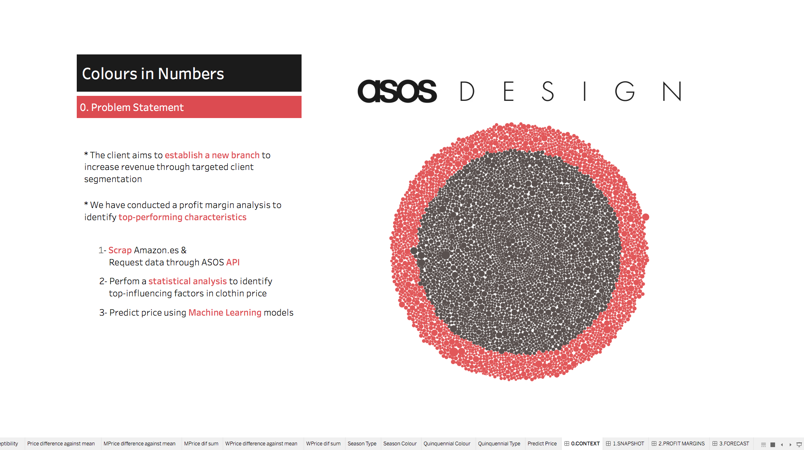
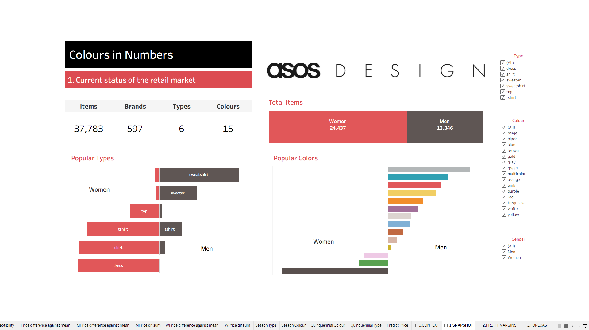
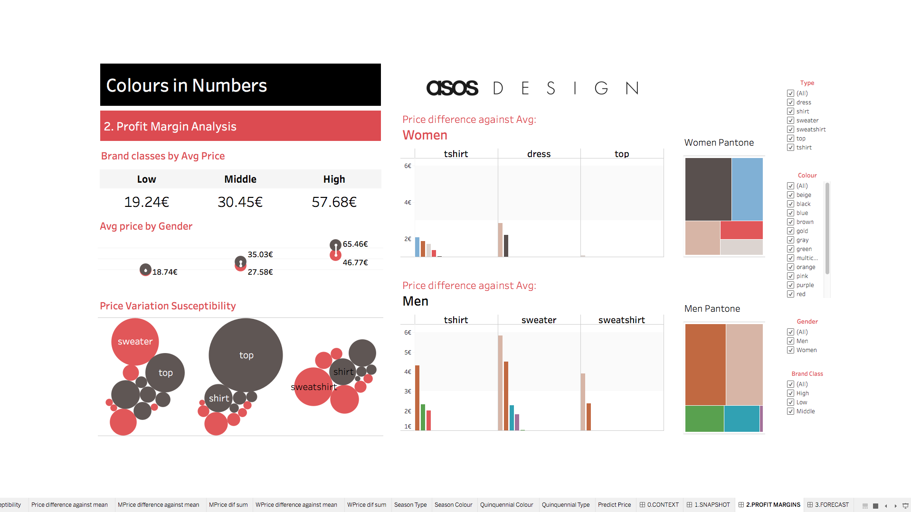
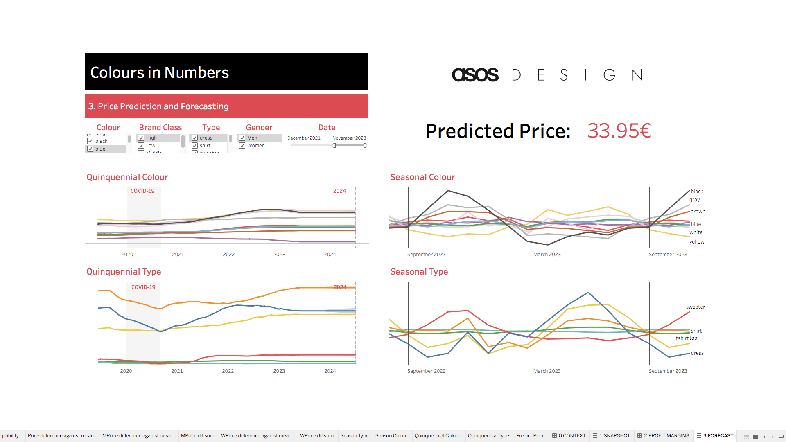

# Colours in Numbers:   Decoding the Best-Selling Hue (3)

### Data Science Research Project

The repository includes:
* raw and clean data (data folder)
* pyhton code (notebooks folder) and, 
* Tableau Dashboards (images).

## Problem statement (Dashboard 0):

Our hypothetical client is the online fashion brand ASOS Design. They aim to launch a new fashion line and seek insights into the aesthetics that might yield higher profitability in the current market.

To address this, I gathered data from Amazon.es and ASOS through web scraping and API connections. Subsequently, I conducted an in-depth statistical analysis to identify the most influential factors affecting garment prices.

## Market Analysis Snapshot (Dashboard 1):

I collected information on over 37,000 products from ~600 brands, categorized into 6 garment types and 15 colors.

* Initially, I observed nearly twice as many women's garments in the online market compared to men's.
* Men's wear predominantly features sweatshirts and sweaters, while women's wear leans towards dresses and shirts.
* The most popular colors in men's fashion are gray and blue, while women's fashion favors multicolored garments (details not displayed in the dashboard) and black.

## Price Variation Analysis (Dashboard 2):

For price analysis, I segmented the ~600 brands into 3 categories based on the average product price.

* I noted that men's clothing tends to be pricier across all market ranges compared to women's wear.
* Additionally, sweaters and tops exhibit more price variation based on color and gender, especially noticeable in low and mid-cost brands.
* On closer inspection, men's garments display more price variation. Notably, beige-colored men's sweaters are €6 more expensive than the average price of other colors.
* Using this data, I generated a palette of profitable colors to establish a new fashion line for ASOS Design.

## Price Projection and Prediction (Dashboard 3):

* I gathered Google search data for both color and garment types to outline fashion trends over five-year and seasonal cycles.
* Confirmed trends include decreased clothing searches during the pandemic and increased interest in "black" during November's "Black Friday."
* Using these timelines, I projected prices for the year 2024.
* Lastly, leveraging all collected information, I constructed a Machine Learning model enabling the client to predict prices for each garment type of interest.

 

## Links of interest:

Data sources:  
[Amazon Spain](https://www.amazon.es/)  
[ASOS Spain](https://www.asos.com/es/)  

Data extraction methods:  
[Rapid API](https://rapidapi.com/)  
[Selenium](https://www.selenium.dev/)  

 
 

-------

# ESPAÑOL    
 
 

Proyecto de investigación aplicando ciencia de datos.

## Contextualización (Dashboard 0):

Nuestro cliente hipotético es la marca de moda online `ASOS Design`. Nuestro cliente quiere abrir una nueva línea de moda y quiere conocer qué estética le puede general mayor rentabilidad en el mercado actual.

Para darles una solución, he recabado datos de Amazon.es y ASOS por medio de "web scraping" y conexión por API. A seguir, he realizado un análisis estadístico exhaustivo con el que identificar los factores más influyentes en el precio de las prendas.

## Análisis de la situación actual del mercado (Dashboard 1):

He recogido información de más de 37,000 productos de ~600 marcas y las he catalogado en 6 tipos y 15 colores de prendas. 

* Lo primero que he observado es que en el mercado online hay casi el doble de prendas femeninas que masculinas.

* Entre las prendas masculinas predominan las sudaderas y sueters mientras que en las femeninas predominan los vestidos y camisas.

* Los colores más populares en moda masculina son el gris y el azul mientras que en la moda feminina predominan las prendas multicolor (datos no mostrados en el dashboard) y el negro.

## Análisis de variación de precio (Dashboard 2):

Para analizar la variación de precio, he dividido las ~600 marcas en 3 clases en base al precio medio de producto. 

* He visto que las prendas masculinas son más caras que las femeninas en todos los rangos de mercado.

* También he observado que los sueters y tops tienen mayor variación de precio en base al color y género. Esta tendencia es más acusada en las marcas low y middle cost.

* Mas detalladamente, he observado que las prendas de hombres tienen mas variación de precio y cabe destacar que por ejemplo, los sueters masculinos de color beige son 6€ más caros que la media del resto de colores.

* Con estos datos, he generado el pantone de colores más rentables para crear una nueva linea de moda para ASOS Design.

### Proyección y predicción de precio (Dashboard 3):

* A continiuación he recabado datos de búsquedas de Google tanto de colores como de tipos de prendas para asi delinear las tendencias quinquenales y estacionales de la moda.

* He podido confirmar el descenso de búsquedas de ropa durante la pandemia, y el ascenso del color negro durante el "black friday" de noviembre. 

* Con estas lineas temporales he generado la proyección de los precios para el año 2024.

* Y finalmente, con toda la información recabada, he reconstruido un modelo de Machine Learning con el que el cliente puede predecir el precio de cada tipo de prenda a su interés.

Espero que os guste mi trabajo, 
Estoy disponible a cualquier duda y sugerencia.

Marina  :)

